*Aayush Sharma*&emsp;*22/06/2026*

---

## **Abstract**

This paper presents a geospatial comparison of settlement development on either side of the Line of Actual Control (LAC) in the Mêdog County (Tibet Autonomous Region, China) / Upper Siang district (Arunachal Pradesh, India) sector, using Sentinel-2 optical imagery, VIIRS nighttime-lights data, and open-source mapping records across eight paired sites. Since China's border-village construction programme predates India's Vibrant Villages Programme (VVP) by roughly six years, the analysis restricts its central comparative claim to the period in which both programmes were concurrently active (2023–2025), using two long-established administrative hubs (Beibeng and Tuting) as a control group. Within this contemporaneous window, two Chinese sites show large, quantifiable, and independently corroborated increases in built-up area, while none of the three comparable Indian village sites show measurable growth. A geospatial check of the specific road corridor linking two of the Indian sites finds no evidence of new construction, consistent with field reporting that the connecting road remains at the feasibility stage. The paper argues that this asymmetry reflects a difference in programme design — construction-first versus roads-first — rather than a difference in investment, intent, or capacity, and that the asymmetry may narrow once India's connectivity infrastructure is completed.

---

## **1. Background and Regional Context**

The eight sites examined in this paper sit directly across the LAC from one another along the Yarlung Tsangpo/Siang river, between Mêdog County in the Tibet Autonomous Region (TAR) and Upper Siang district in Arunachal Pradesh.

### **1.1 China's border-village programme**

In July 2017, the government of the TAR announced the "Plan for the Construction of Well-off Villages in the Border Areas of the Tibet Autonomous Region (2017–2020)," committing to build more than 600 *xiaokang* ("moderately prosperous") border villages across 21 border counties, with a stated initial investment of approximately CNY 30.1 billion [1][2]. Independent satellite-imagery analysis by the Center for Strategic and International Studies (CSIS) ChinaPower Project has documented the construction of these villages along the eastern sector of the LAC, characterizing them as "dual-use" settlements that frequently incorporate military or paramilitary infrastructure alongside civilian housing, and noting their role in China's broader strategy of establishing population and infrastructure presence in disputed border areas [3]. The same CSIS analysis explicitly frames India's subsequent border-village programme as a reactive measure, concluding that "India will find it challenging to keep pace with China" [3] — a claim this paper tests empirically for one specific micro-sector rather than accepting at face value.

### **1.2 India's Vibrant Villages Programme**

India's Vibrant Villages Programme (VVP) was approved in February 2023 as a centrally sponsored scheme covering 662 villages across 19 districts in four northern border states (Arunachal Pradesh, Himachal Pradesh, Sikkim, Uttarakhand) and the Union Territory of Ladakh, with the explicit goals of improving connectivity, housing, and renewable-energy access in remote border settlements [4]. A second phase, VVP-II, was approved in April 2025 with a ₹6,839 crore outlay extending coverage to additional border states [4]. Within Arunachal Pradesh specifically, the Ministry of Home Affairs had approved 187 projects worth approximately ₹105 crore as of early 2024, of which road infrastructure — 105 roads covering 1,022 km — accounted for roughly ₹2,205 crore, by far the largest single budget line in the programme [5].

### **1.3 The specific corridor**

Two of the four Indian sites in this study, Gelling and Bishing, are separated by the Siang river and connected only by a footbridge and trekking paths; Bishing has historically been reachable only via a roughly 7 km trek from Gelling, with no direct road connectivity [6]. A Gelling–Bishing Defence Road has been proposed, and as of a Deputy Commissioner field visit on 16 September 2025, the project remained at the feasibility-study stage [7]. Notably, road-building activity in this exact corridor has not been one-sided historically: in January 2018, villagers and Indian security personnel reported that a Chinese road-construction team had entered roughly 1 km inside Indian territory near Bishing before being intercepted, with construction equipment subsequently seized [8]. Other regional connectivity improvements have occurred — the Border Roads Organisation inaugurated the Rabung Bridge in December 2019, improving access to border posts at Gelling and Bishing [9] — but the last-mile Gelling–Bishing link itself remains unbuilt.

| 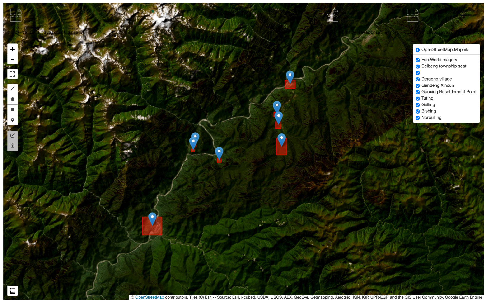 |
| :---: |
| *Sector overview map for the 8 AOIs* |

---

## **2. Methodology**

### **2.1 Data sources**

Built-up area was estimated using Sentinel-2 Level-2A surface reflectance imagery (`COPERNICUS/S2_SR_HARMONIZED`), cloud-masked using the Cloud Score+ dataset (`cs_cdf` ≥ 0.6), composited as a per-pixel median across each site's filtered image collection. Nighttime radiance was estimated using the VIIRS Day/Night Band monthly composite (`NOAA/VIIRS/DNB/MONTHLY_V1/VCMSLCFG`), averaged annually. Both datasets were accessed and processed via the Google Earth Engine platform. Site identification used OpenStreetMap records and Esri World Imagery basemaps for visual cross-validation, since no public coordinate list exists for these specific village sites.

### **2.2 Built-up area index**

Built-up area was quantified using the Normalized Difference Built-up Index (NDBI), defined as (SWIR1 − NIR)/(SWIR1 + NIR), thresholded at NDBI > 0 and summed via pixel-area integration at 10 m resolution [10]. NDBI is a standard, peer-reviewed method for automated built-up area mapping [10][11], but the literature is explicit that it cannot reliably distinguish built-up surfaces from bare or open land, since both produce elevated NDBI values [12]. Index-differencing methods of this kind are also known to be sensitive to seasonal and illumination variation between image dates [13]. Accordingly, all NDBI-based findings in this paper were visually cross-checked against true-color Sentinel-2 and Esri World Imagery composites before being treated as confirmed.

### **2.3 Temporal design and the timeline confound**

Composites were generated for five dry-season epochs (November–March of 2017, 2019, 2021, 2023, and 2025) to allow a long-run view of each site. However, because China's settlement programme began in 2017 and VVP began only in 2023, a flat comparison across the full 2017–2025 span would conflate genuine programmatic asymmetry with a six-year head start. The paper's central comparative claim is therefore restricted to the 2023–2025 window, in which both programmes were concurrently active. Two long-established administrative/military hubs — Beibeng (China) and Tuting (India) — are tracked across the full 2017–2025 series and used as a control group: both predate either programme and both should, if the rest of the comparison is sound, show no programme-driven change.

### **2.4 Corridor verification**

To test whether the proposed Gelling–Bishing road shows any geospatial signature, a combined NDBI/Bare Soil Index (BSI) differencing approach was applied to the corridor between the two villages for the 2023–2025 window specifically — matching the contemporaneous-comparison logic above, since a longer baseline would reintroduce the timeline confound this test is meant to avoid. BSI was calculated as ((SWIR1 + Red) − (NIR + Blue))/((SWIR1 + Red) + (NIR + Blue)) [14]. Pixels were flagged only where both NDBI and BSI increased by more than 0.1 between 2023 and 2025, and the existing village footprints were masked out so that the test isolates change in the corridor itself rather than within either settlement.

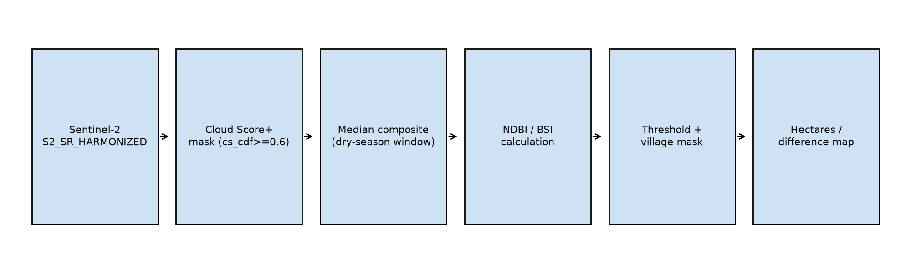

---

## **3. Observations and Findings**

### **3.1 Quantified contemporaneous growth**

Within the 2023–2025 window, two Chinese sites show substantial, measurable increases in built-up area. The Guoxing Resettlement Point grew from approximately 16 ha to approximately 92 ha — a roughly sixfold increase in two years. Gandeng Xincun shows an earlier but still-relevant jump, from approximately 8 ha to approximately 28 ha between 2019 and 2021, independently corroborated by VIIRS nighttime radiance, which rises from 0.21 to 0.39 in the same calendar year — two independent measurements agreeing on both magnitude and timing.

By contrast, across the same windows, none of the three comparable Indian village sites — Gelling, Bishing, and Norbulling — show measurable built-up area growth; each remains within a roughly 1–4 ha range across the entire 2017–2025 series.

The control sites support attributing this growth specifically to programme activity rather than a generic regional trend: Beibeng's built-up area ranges from approximately 48 to 64 ha across the full 2017–2025 series with no net growth, and Tuting's ranges from approximately 227 to 244 ha over the same period, also without net growth. Both predate their respective national programmes and both stay flat throughout, including during the exact years when Guoxing and Gandeng Xincun were growing rapidly.

One further China-side site, Dergong village, shows substantial growth (26 ha to 48 ha) — but this growth occurred entirely between 2017 and 2019, before VVP existed, and the site plateaus thereafter. It is excluded from the core contemporaneous comparison for this reason, though it is noted here for completeness.

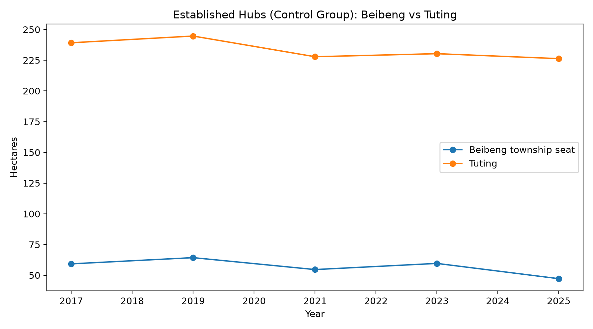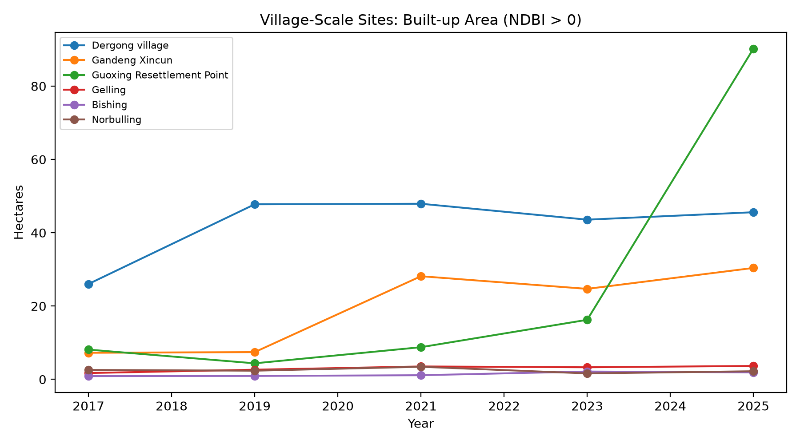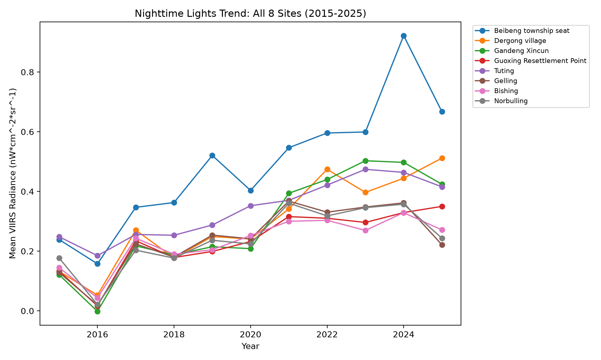

### **3.2 Visual and morphological evidence**

Independent of the quantitative indices, direct visual inspection of Guoxing's own Sentinel-2 imagery shows a clean, unambiguous progression: bare, graded earth clearings visible by 2023, replaced by a dense, regular building grid by 2025. This sequence requires no index or threshold to interpret and serves as the paper's clearest single piece of evidence.

A further, qualitative distinction is visible across all sites: the Chinese village sites (Beibeng, Dergong, Gandeng Xincun, Guoxing) consistently display an orthogonal, rowhouse-style grid layout, a pattern independently documented by CSIS ChinaPower's satellite-imagery analysis of other xiaokang villages along the LAC, which similarly describes "new buildings of identical shape" appearing in tight, regular formations [3]. The Indian village sites, including the larger and longer-established Tuting, show organic, irregular layouts that have not been systematically gridded even where the settlement is large.

| 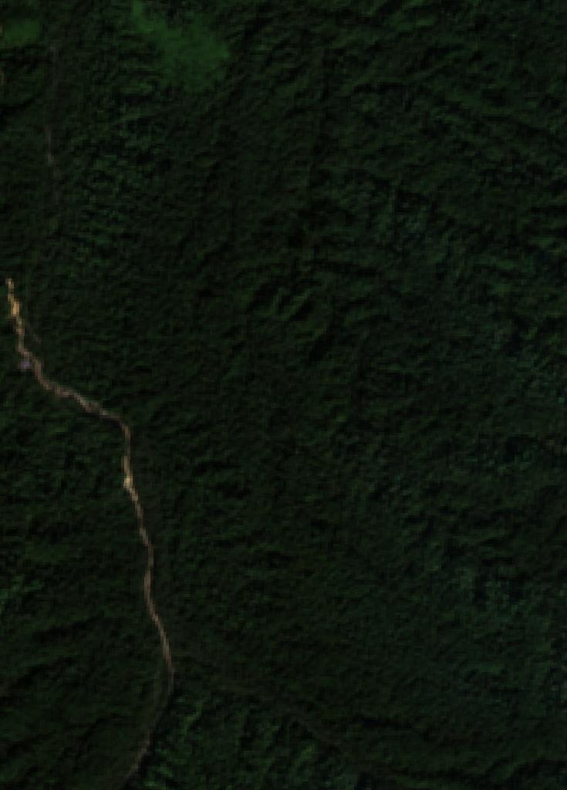 | 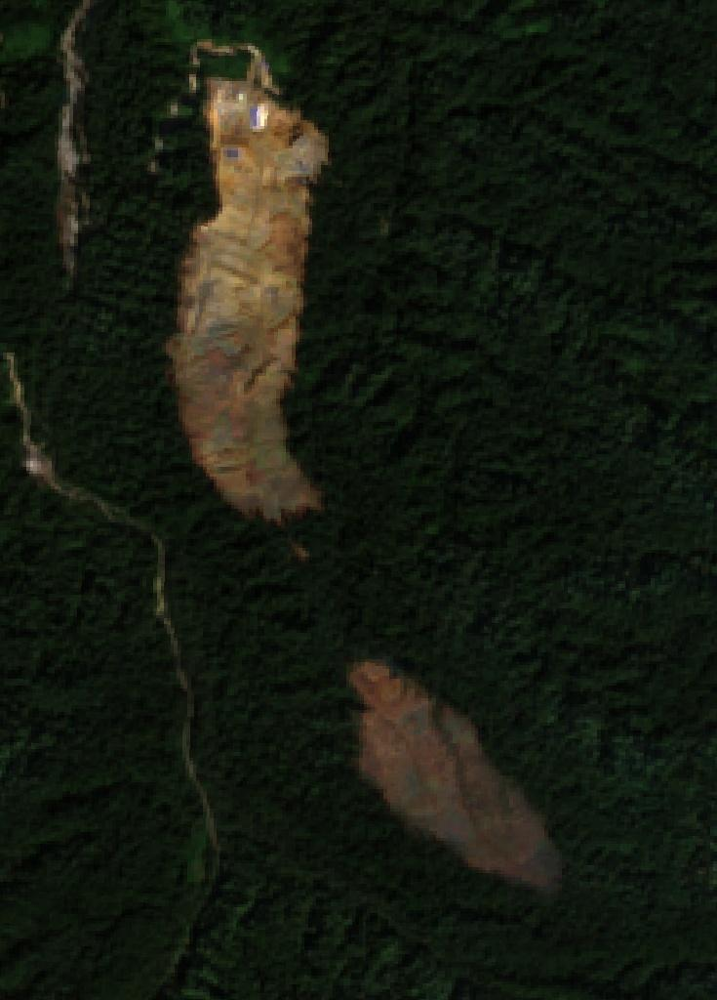 | 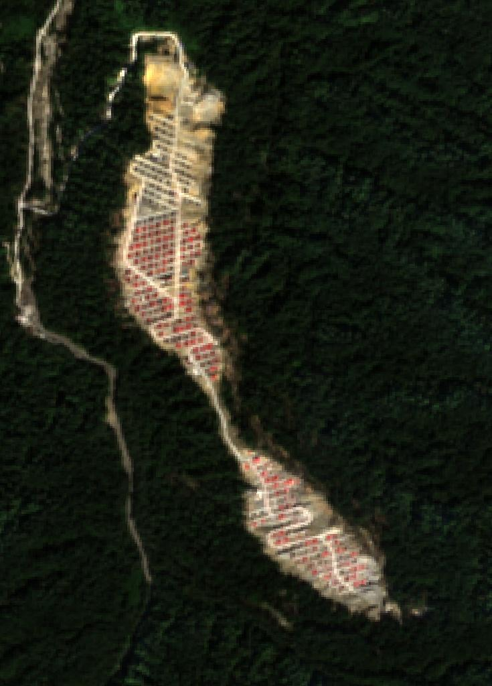 |
| ----- | ----- | ----- |
| *Guoxing (2021)* | *Guoxing (2023)* | *Guoxing (2025)* |

| 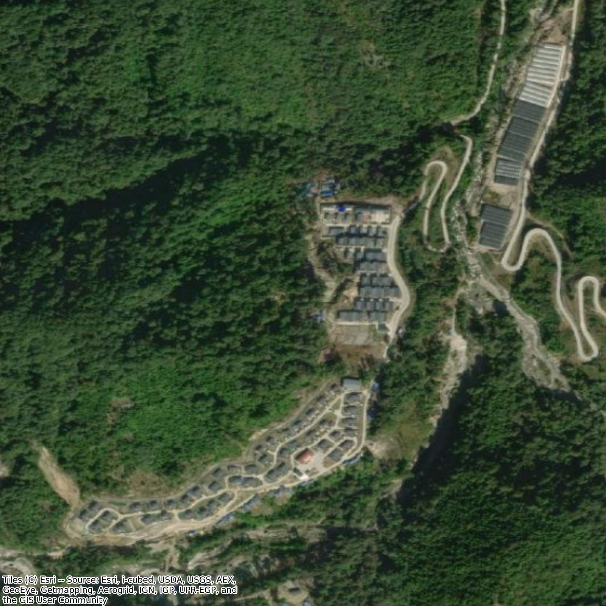 | 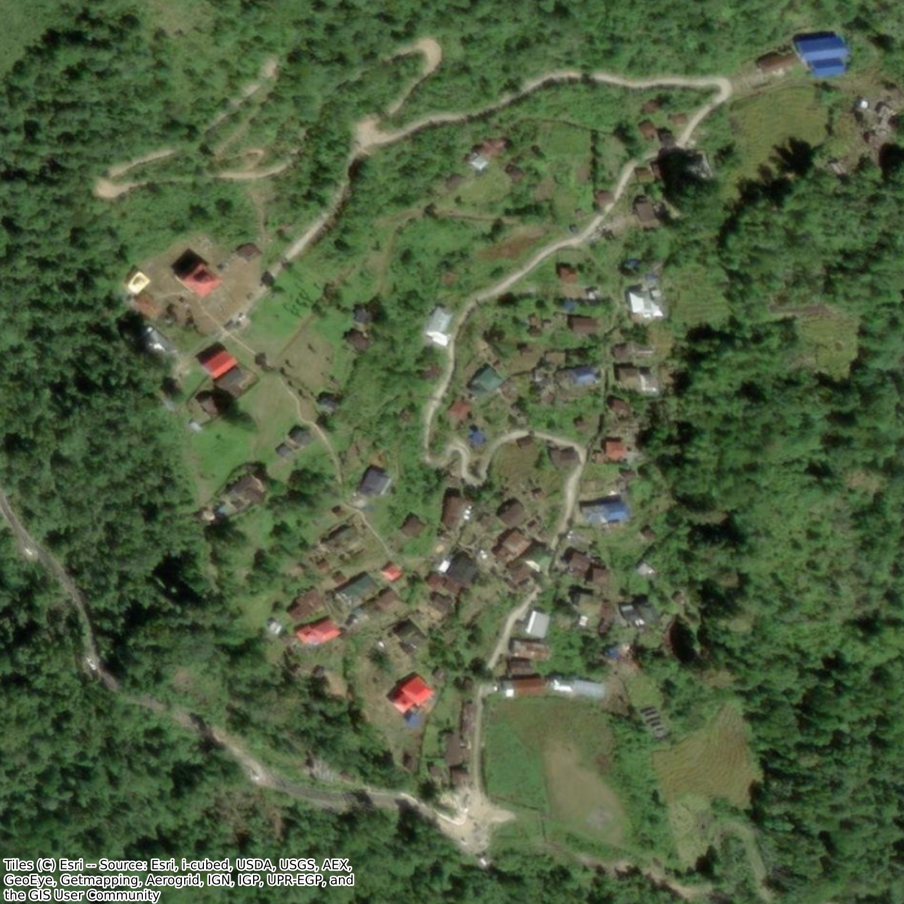 |
| :---: | :---: |
| *Gandeng Xincun's Grid Layout* | *Gelling's Organic Layout* |

### **3.3 Institutional mechanism**

The preceding asymmetry is consistent with the structure of India's own programme budget. VVP-I's roads component — 105 sanctioned roads covering 1,022 km, at an estimated cost of ₹2,205 crore — represents the single largest line item within the scheme, exceeding combined spending on tourism and other village infrastructure [5]. In other words, VVP's stated strategy in this region is roads-first, not construction-first.

This prediction is borne out by direct geospatial testing. Applying the NDBI/BSI corridor-differencing method described in Section 2.4 to the Gelling–Bishing corridor for 2023–2025 identifies approximately 59 ha of pixels meeting the combined threshold — but visual inspection shows this area is composed of scattered, disconnected patches rather than a single continuous linear feature; the one continuous linear feature visible in the difference image corresponds to the Siang riverbed itself, a known source of false signal in index differencing due to seasonal water-level and sandbar variation between composite dates. No continuous new bare-earth or built corridor consistent with road construction is visible between the two villages. This null result independently corroborates field reporting that the Gelling–Bishing Defence Road remained at the feasibility-study stage as of September 2025 [7], and is further consistent with longstanding reporting that Bishing has no direct road connectivity and remains reachable only by a roughly 7 km trek from Gelling [6].

| 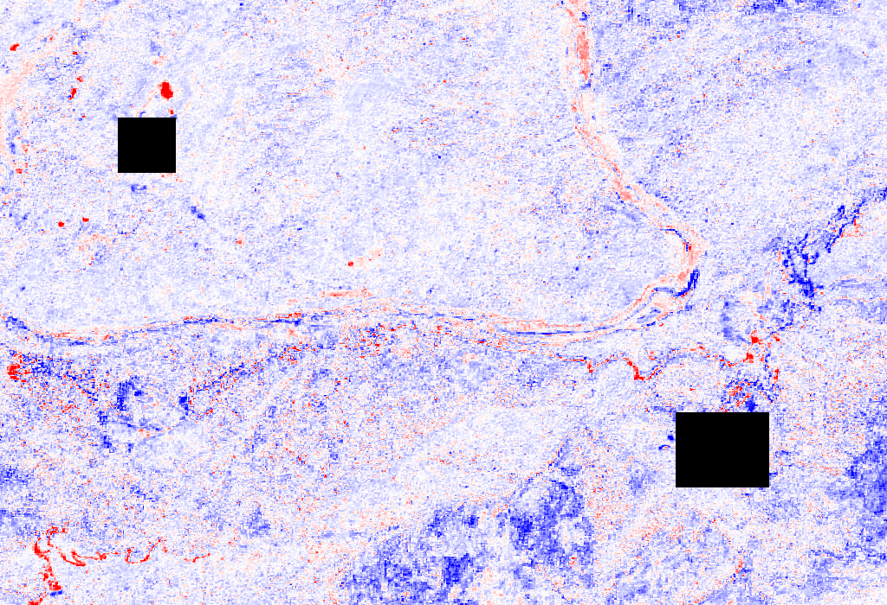 |
| :---: |
| *NDBI difference map, Gelling–Bishing corridor, 2023 vs. 2025, with village footprints masked* |

---

## **4. Limitations**

This analysis has several acknowledged constraints. NDBI cannot fully distinguish built-up surfaces from bare or cleared soil; all index-based findings reported here were visually verified against true-color imagery for this reason, but residual misclassification at smaller sites cannot be ruled out. NDVI and BSI were not computed across the full historical time series, only for the corridor-specific test in Section 3.3. VIIRS data prior to 2017 was excluded as an artifact of the sensor's early calibration period. Esri World Imagery basemap capture dates are not always known with precision and should not be treated as contemporaneous with the Sentinel-2 record. Finally, OpenStreetMap tags used for site identification and cross-validation are crowd-sourced and were treated throughout as a corroborating, not authoritative, source.

---

## **5. Conclusion**

Within this specific LAC sector, China's settlement programme has produced measurable, independently corroborated, contemporaneous growth at two sites since 2023, while India's Vibrant Villages Programme — launched the same year — has not yet produced comparable settlement growth at its corresponding villages. The evidence does not support attributing this gap to a lack of investment or intent: VVP's budget structure shows a deliberate roads-first strategy, and the specific connecting road this paper tested geospatially remains, as of the most recent available reporting, at the feasibility stage rather than absent from planning altogether. The more precise characterization is one of differing programme design — construction-first versus roads-first — rather than differing capability. Guoxing's own trajectory, from bare graded earth to a densely built grid within two years of sustained investment, suggests that comparable visible change on the Indian side may follow once its connectivity infrastructure, rather than its settlement construction, reaches a similar stage of completion. This is, on present evidence, a "not yet" finding rather than a structural one.

---

## **References**

[1] International Campaign for Tibet. "New 'defense' villages and infrastructure being built on Tibet's border." December 2019. https://savetibet.org/new-defense-villages-and-infrastructure-being-built-on-tibets-border/

[2] Centre of Excellence for Himalayan Studies, Shiv Nadar University. "Beyond the Military Prism: China's Development Objectives in Xiaokang Villages in Tibet Autonomous Region." https://snu.edu.in/centres/centre-of-excellence-for-himalayan-studies/research/beyond-the-military-prism-chinas-development-objectives-in-xiaokang-villages-in-tibet-autonomous-region/en/

[3] Jun, J. and Hart, B. "China Is Upgrading Dual-Use Villages along Its Disputed Indian Border." ChinaPower Project, Center for Strategic and International Studies. May 16, 2024 (updated July 22, 2024). https://chinapower.csis.org/analysis/china-upgrading-dual-use-xiaokang-villages-india-border/

[4a] Government of India, Ministry of Home Affairs. Lok Sabha Starred Question No. *110, answered 3 December 2024. https://www.mha.gov.in/MHA1/Par2017/pdfs/par2024-pdfs/LS03122024/110.pdf

[4b] Government of India, Ministry of Home Affairs. Lok Sabha Unstarred Question No. 508, answered 3 February 2026. https://www.mha.gov.in/MHA1/Par2017/pdfs/par2026-pdfs/LS03022026/508.pdf

[5] Sentinel Assam. "Home Affairs Ministry approves 187 projects worth 104 crore under Vibrant Village Programme (VVP)." https://www.sentinelassam.com/north-east-india-news/arunachal-news/home-affairs-ministry-approves-187-projects-worth-104-crore-under-vibrant-village-programme-vvp

[6] Wikipedia. "Bishing." https://en.wikipedia.org/wiki/Bishing

[7] Eastern Sentinel. "DC inspects dev projects in Tuting." September 16, 2025. http://www.easternsentinel.in/news/state/dc-inspects-dev-projects-in-tuting.html

[8] Business Standard. "'Chinese road-building team entered 1 km inside India, sent back by Army'." January 2018. https://www.business-standard.com/article/current-affairs/chinese-road-building-team-entered-1-km-inside-india-sent-back-by-army-118010300778_1.html

[9] The Arunachal Times. "Min inaugurates strategic bridge between Migging and Tuting.". https://arunachaltimes.in/index.php/2019/12/28/min-inaugurates-strategic-bridge-between-migging-and-tuting/

[10] Zha, Y., Gao, J., and Ni, S. (as discussed in) "Study of Normalized Difference Built-up (NDBI) Index in Automatically Mapping Urban Areas from Landsat TM Imagery." https://www.researchgate.net/publication/339230287_STUDY_OF_NORMALIZED_DIFFERENCE_BUILT-UP_NDBI_INDEX_IN_AUTOMATICALLY_MAPPING_URBAN_AREAS_FROM_LANDSAT_TM_IMAGERY

[11] Farmonaut. "Normalized Difference Built-up Index: Urban Change Guide." https://farmonaut.com/remote-sensing/normalized-difference-built-up-index-urban-change-guide

[12] "Improved NDBI differencing algorithm for built-up regions change detection from remote-sensing data: an automated approach." Remote Sensing Letters, Vol 4, No 5. https://www.researchgate.net/publication/250614042_Improved_NDBI_differencing_algorithm_for_built-up_regions_change_detection_from_remote-sensing_data_An_automated_approach

[13] "Image processing and AI techniques for climate change detection using remote sensing: a comprehensive review." Frontiers in Artificial Intelligence, 2026. https://www.frontiersin.org/journals/artificial-intelligence/articles/10.3389/frai.2026.1814362/full

[14] Rikimaru, A., Roy, P.S., and Miyatake, S. (2002). "Tropical forest cover density mapping." Tropical Ecology, 43(1): 39–47.

---

*Note on data provenance: all built-up area, nighttime radiance, and corridor-differencing figures reported in Sections 3.1–3.3 are original analysis by the author, derived from Sentinel-2 and VIIRS imagery as described in Section 2, and are not drawn from external sources.*
